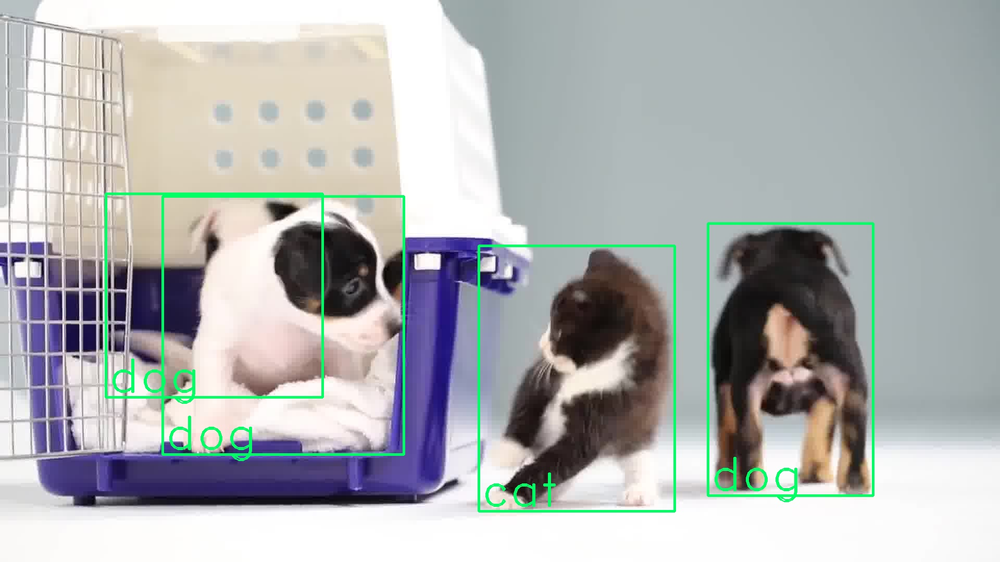
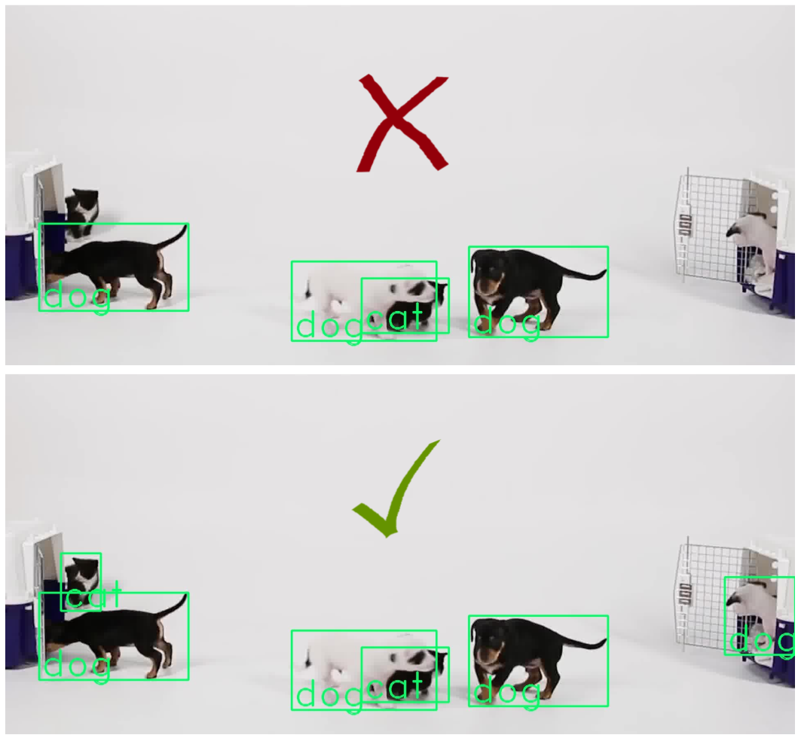
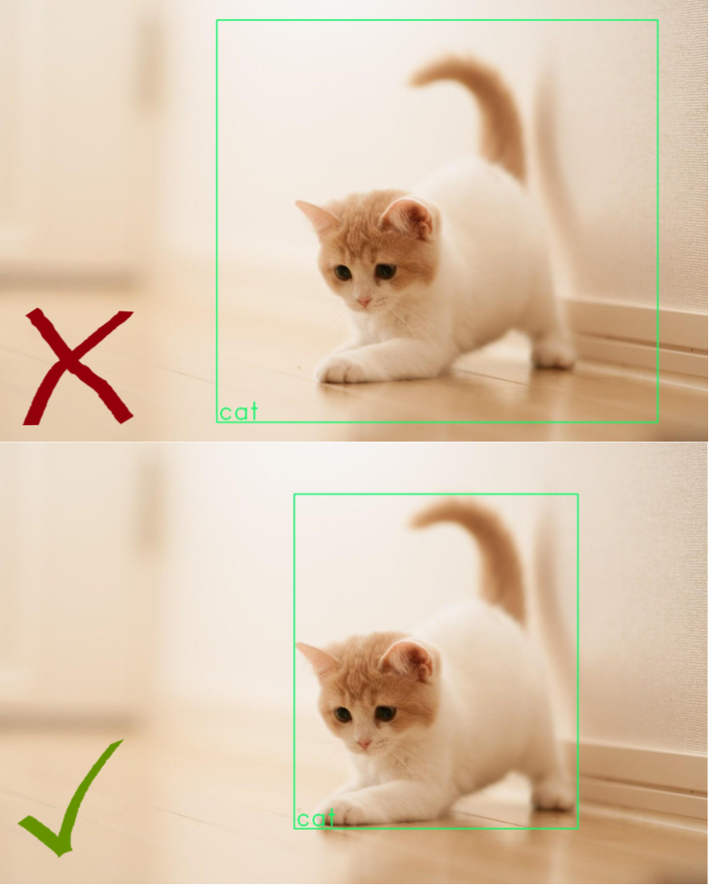
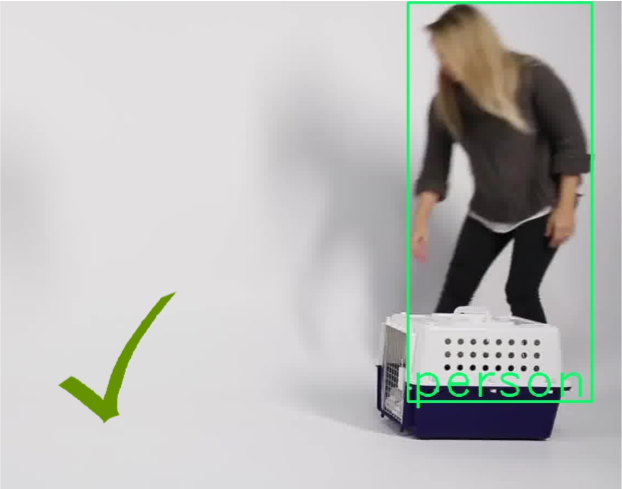

This blog post is meant for annotators who are embarking on their journey to help label data for object detection. We hope to briefly introduce you to the computer vision task and *your* task as an annotator.

## 1. Introduction

Object detection is a computer vision task of localising and classifying objects of interest &mdash; There are some objects I want to find in an image frame.. where are they, and what are they?

In our work, we want to train an AI model to perform this task of object detection. To do that, we need to provide the AI model with the ground-truths during training. AI models are very data-hungry, they require huge amounts of **labelled** data to train well. We are talking in orders of tens of thousands images.

Just to clear up some jargons up front:

- **Annotation = Labels**, to "teach" our AI models the ground-truths.
- **Classes = Categories** of objects defined by us, for example, Cats, Dogs, Horses, etc.  

## 2. Format

Annotations for an Object Detection task comprise of bounding boxes (bbs) and their respective class labels:

 1. Bounding boxes: Bbs are rectangular boxes (typically not rotated, aka, aligned with the edges of the image). The bbs tightly bound out the objects of interest in the image.
 2. Class labels: The class label is then given for each bb to say what it is &mdash; is it a cat? or is it a dog?

## 3. Some Standards

### Quality over Quantity

We prefer **good** annotations instead of getting annotations done fast. This is because the quality of data and its labels is critical to the training of the AI model and its eventual accuracy. Take your time and be thorough!

We understand it will get repetitive and droning, so take a break when you find yourself zoning out! Take a walk, eat something..

Then return to the grind!

### Be Exhaustive

Often, there will be multiple objects of interest in one frame, we will need **all** of the objects to be annotated. A partially annotated image is worse than having no image at all, because it will throw off the AI model during its training.  

### Make it Tight

Bounding boxes should tightly bound the object of interest to the limits of what is considered the part of the object (for example, the cat's tail is part of the cat, so the bounding box should include the tail). Having loose bounding box is an example of poor quality annotation.

### Handling Partial Occlusions

You will definitely face cases where the object of interest is partially block by another object or obstacle. In these cases, try your best as a human to imagine/hallucinate the full extent of the object, and draw your bounding box accordingly.

 

## 4. Tracking in Video Data

 
Here, we will introduce a complementary task that we may require you to do on top of drawing bbs and labelling their classes, which may also aid in easing your annotation efforts.

Very often, our data can be sequential frames from a video. Meaning that as you traverse through the images, you will "see" a video. We can make use of this temporal aspect to ease the load of annotation as well. Imagine a car driving across 100 video frames from left to right &mdash; instead of drawing a bb for 100 times on the 100 frames, we can make use of "tracking".

One way of doing this tracking is through *interpolation*. To illustrate, imagine if you just annotate the car on frame 1, frame 50 and frame 100 &mdash; these frames where you make a manual input on where the bb is at is what we call a *Keyframe*. So, for all the frames in between the *keyframes*, the tool will linearly interpolate the bb locations for you.

You will still need to check through every frame afterwards. And of course, as you can imagine, this will not always work accurately for every frame and you will still have to adjust the locations slightly for some of the frames.

*Will update further with more details/illustrations.*

## 5. Using the annotation tool

In DH, we leverage primarily on the open-source annotation tool [**CVAT**](https://github.com/opencv/cvat). We will install the tool for you on your computer, so your main reading will be to study their user guide so you know how to use the tool effectively: [CVAT User Guide](https://github.com/opencv/cvat/blob/develop/cvat/apps/documentation/user_guide.md). Please take some time to read this!
