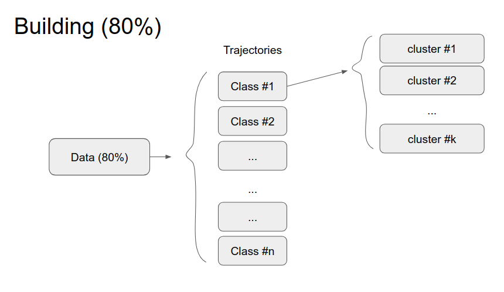
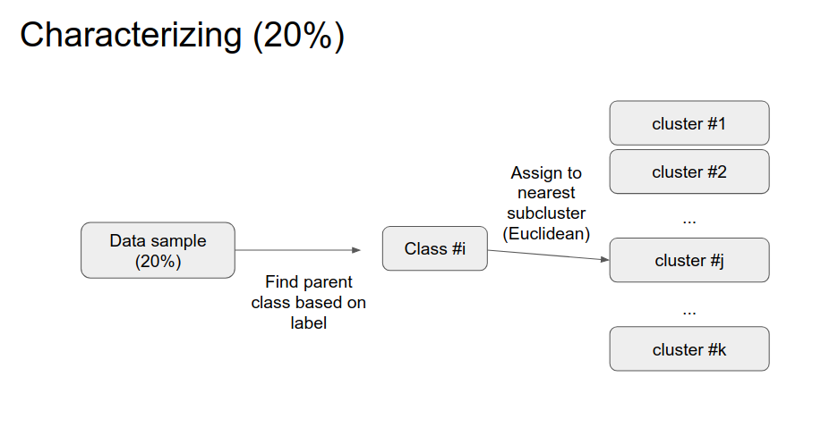
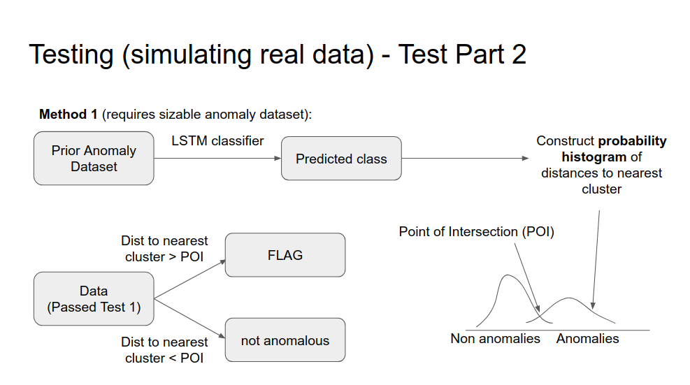
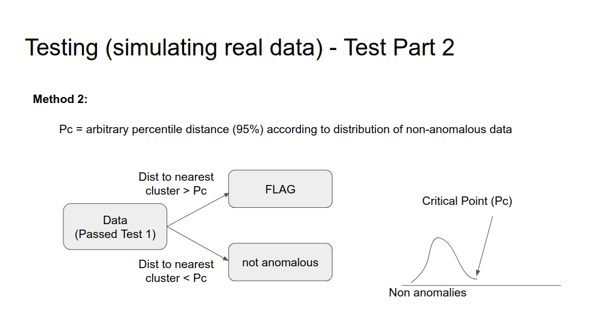
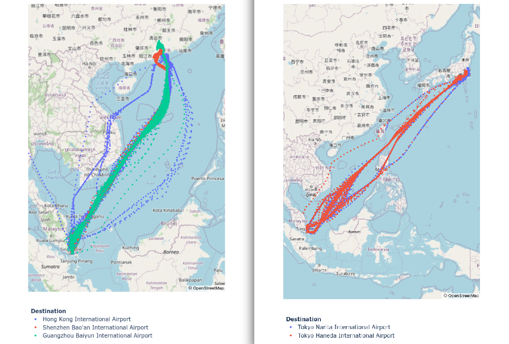
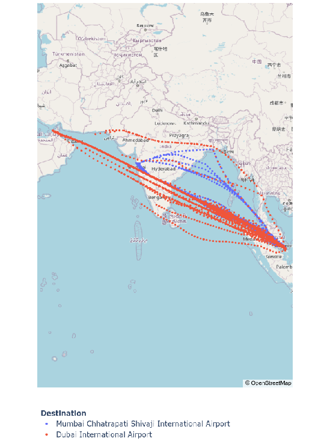

With so much data out there, we are finding an increasing number of use cases for such data. GPS and other types of location data are very useful especially under circumstances where there is a lot of repeated activity and there is a need to identify unusual activity. It could be applied to, among other things, robot data in warehouses, ground and air traffic control and prediction, and even medical imaging like brain scans. This project explores the **use of labelled data to construct a model that can be used to flag anomalous, future unlabelled data**, in the context of flight trajectories.

Trajectory Anomaly Detection, intuitively speaking, should be an easy task, at least to humans. If we have airplanes sending out location pings periodically over the course of their flights, all it takes is for us to plot out those ping locations on a map, identify what common routes there are, and what trajectories deviate from these common routes. In machine learning parlance, these are the tasks of **clustering** and **outlier detection**, and requires nothing more than a pre-existing dataset from which to detect anomalies **(i.e. the definition of "anomaly" is contextual and changes from dataset to dataset)**. This post outlines the following content areas:
* The Dream Algorithm
* LSTM for Classification and Anomaly Detection
* Clustering - 1 Trajectory: 1 Cluster
* Clustering - 1 Trajectory: Multiple Subclusters (success)
* Summary
* Using the Code

The Dream Algorithm
-------------------
The fantasy is to have an algorithm that is so general that it can be applied to any trajectory type (flights? roadtrips?) regardless of context (no labels required) so that minimal manual feature-encoding / data preprocessing is required; all we have to do is to throw at it a large CSV file of clearly labelled trajectories, and it'd be able to identify trajectories that seem anomalous.

But of course one can only dream :(. In reality, data is messy, and the following problems stand in the way of general clustering algorithms:
* trajectories are incomplete and have variable length
* trajectories have different start and end-points
* location pings are irregularly distributed over time
* significant proportion of pings could have been sent while the plane was still on the ground
* trajectories may be noisy and have outlier pings (perturbations)

As clustering algorithms, at their essence, aim to associate datapoints (in our case, trajectories) that have a short distance to each other into clusters, having all these inconsistencies is a large hindrance to being able to do consistent, fair comparisons between trajectories to obtain distance measures. For example, flight A and flight B may share the same flight route each send out 500 pings over the flight duration, but if 100 of flight A's pings were sent before takeoff, and flight B's pings were all sent after takeoff, the distance measure between flight A and flight B would be artificially inflated because of the extra apparent distance between the two flights during the first 100 pings.

Since clustering is not a new task by any means, much work has been done on it, and indeed, there is a promising algorithm that tackles this specific problem of temporally warped data, wherein the shapes of 2 series of data are basically the same, but compressed and stretched differently over time. This algorithm is called **Dynamic Time Warping (DTW)**, but whereas a simple Euclidean distance measure has a time-complexity of O(N), DTW has a time-complexity of O(N2). In a dataset of about only four thousand flights, each interpolated to only about 50 pings regularly spaced over their respective time-of-flight, this easily exploded the clustering time from about 10 minutes, to about 5 hours.

In addition, due to all these artificially inflated distances, the distance threshold for any trajectory to be considered part of a cluster would have to be high. From trials with QuickBundles (explained later), it was found that even with a distance threshold of between 200km and 300km, about 80% of trajectories were in clusters of 5 of fewer, meaning that not many meaningful clusters were found, and that most trajectories were "far" away from each other. With such a high threshold, any comparison between fully formed trajectories from 2 different flight routes stood a good chance of being associated together as well.

There are **some approaches to try to standardize the data**, and they include:
* providing airport location data to discern when a plan has truly left the airport, so as to trim off pre-takeoff and post-landing segments
* interpolating and smoothing
* Taking inter-flight distance measure to be the proportion of inter-flight distance to total flight distance (of either of the trajectories being compared)
* ...

As you can tell, these are highly inflexible, hard-coded features, hyperparameters, and decisions that would have to be rethought from dataset to dataset. The dream algorithm remains unattainable for now, but if there's an approach that fits the bill in being dynamic, general, generalizable, and runnable on unlabelled data, it would be a form of unsupervised deep-learning model that requires this flight trajectory anomaly detection question to be reformulated into a regression-type problem statement. More on that at the end of this post.

Dynamic and General Enough - LSTM for Classification and Anomaly Detection?
---------------------------------------------------------------------------
As much as neural networks look like a cheap, easy fix for any computationally complicated task, their self-tuning properties make them the best candidate for the clustering segment of this task, just that we have to now turn this "clustering" problem into a "classification" problem, wherein class labels are needed. Fortunately, we do have class labels to use; for this project, we'll use only flights that originate from "Singapore Changi Airport" and treat flight destinations as the class labels. **In English, the neural network has to take a series of location pings, and figure out which pings are important to consider, what features to glean from it, so that it can make a prediction of what trajectory type it is. It sounds like the perfect job for Long-Short-Term Memory (LSTM) networks.**

The anomaly-detection mechanism would then be the confidence level of the prediction. In an ideal scenario, non-anomalous flights would be predicted with a high confidence, and anomalous or strange new trajectory types should be assigned to a class with a low confidence regardless of what class it is - *ideally*. Experimentation time!

### Data Pipeline
1) **Filter**: From a commercial dataset of outgoing flights originating from Singapore Changi Airport, only flights bound for the top 23 destinations were used as "normal" or non-anomalous flights (i.e. part of training set).
2) **Filter**: Based on class label and airport information, an inter-airport distance is calculated, and only flights above a certain minimum percentage of completeness (with respect to the inter-airport distance), are retained.
3) **Preprocessing**: A slice of arbitrary duration (above minimum percentage) is taken from each flight, and interpolated to 50 timestamps and treated as a training input sample. A training label sample naturally took the form of a one-hot encoded 23-vector representing the correct destination (class) of the flight. Each timestamp was a 5-vector containing:
   * Latitude
   * Longitude
   * Altitude
   * Heading
   * Speed

With a dataset of 4181 flights, several LSTM model variations built using Keras were trained on 90% (3762) of the flights and were evaluated on the remaining 10% (491) flights. It turns out that a fairly small model of 8 layers and hidden size of 32, trained on 200 epochs over slightly under an hour, performed the best. 

These were the **statistics on the non-anomalous 10% test** set:
>* Prediction rate: 94.749%
>* Confidence mean: 96.206%
>* Confidence S.D.: 10.511%

Pretty good!

### Anomaly Detection - Failed
I then fed in multiple unseen trajectory types (not in training set) to see what the confidence statistics were like for anomalies. The results were rather horrible; here are the statistics on a trajectory type I consider to be a good test-case for anomalies: flights to Surabaya Juanda International Airport. I consider this a good test case because even though it is near and going in a similar direction as its 2 neighboring trajectories - Jakarta and Sydney - all flight trajectories are clearly defined and distinct (either direction-wise, or length-wise) from each other. There are no other trajectories in the training set that overlapped any of these 3 flights either.
>* Prediction class: 97 / 104 Jakarta, 7 / 104 Sydney
>* Confidence mean: 98.783%
>* Confidence S.D.: 5.895%

The LSTM was obviously not senstive enough to anomalies. Such high confidence scores for anomalies were more or less consistent across all anomaly trajectory types. I removed Sydney from the training set, and the LSTM classified Surabaya flights as Jakarta flights with even higher confidence (99.998%)! The LSTM is definitely tuning itself to identify flights as Jakarta flights, but there aren't enough examples that are similar enough to Jakarta flights but **not** Jakarta flights to teach it what truly constitutes a Jakarta flight and what does not.

What's interesting is that clearly, a human can look at the 3 clusters of flights and know that they're 3 distinct clusters, but an LSTM isn't able to decipher that information. But if we think about it on a more fundamental level, it still boils down to concepts related to clustering. We can identify 3 clusters because the distances between flights of a single cluster are much lower than the distances between flights of different clusters, so we can clearly attribute the former to spread of a distribution and the latter to a difference of distribution altogether. An LSTM doesn't encapsulate such comparative information well. If there's a way to preprocess a 6th variable to capture such comparative information in the context of any single flight's neighbors, that would certainly be a neat way to solve this problem with a single model.

Unfortunately, that's not possible, so it's best to **explore clustering as part two of this problem, and use the LSTM for its good performance in classification as a working part one.**

Clustering - 1 Trajectory: 1 Cluster
------------------------------------
The idea here is to use the training data to construct trajectory-specific clusters. This means that we take the training data, group them by destination (trajectory type), and treat each group as 1 cluster. 23 trajectory types hence means 23 clusters. It is the centroid of the cluster, as well as the distribution of distances between cluster members and the parent centroid, that we're really interested in.

The anomaly detection mechanism is then to put the unseen trajectory sample through the LSTM, and to calculate the distance between this unseen sample and the centroid of the cluster that the LSTM predicted this unseen trajectory to be part of. The *ideal* situation would be that anomalies would show a much greater distance than non-anomalies to the point that the probability of using distance to correctly flag anomalies would be statistically significant.

### 1 Trajectory: 1 Cluster - Results
Results were mixed. Sometimes, the separation between non-anomaly and anomaly distance distributions was good. The following analysis of distance statistics assumes that all distributions follow a Normal distribution. To flag anomalies, we find the point of intersection of both distributions, and deem that anything that has a to-centroid distance larger than this point of intersection as an anomaly.

> Jakarta (non-anomaly) flights:
> * Jakarta cluster member to Jakarta centroid distance mean: 47.209km
> * Jakarta cluster member to Jakarta centroid distance S.D.: 28.002km
> 
> Non-Jakarta (Surabaya) flights:
> * Non-cluster member to Jakarta centroid distance mean: 240.320km
> * Non-cluster member to Jakarta centroid distance S.D.: 135.508km
> 
> Statistics:
> * 5.9% undetected anomalies
> * 4.9% false positives

But at other times, it was not that great...
> Sydney (non-anomaly) flights:
> * Sydney cluster member to Sydney centroid distance mean: 588.722km
> * Sydney cluster member to Sydney centroid distance S.D.: 373.305km
> 
> Non-Sydney (Surabaya) flights:
> * Non-cluster member to Sydney centroid distance mean: 746.916km
> * Non-cluster member to Sydney centroid distance S.D.: 91.701km
> 
> Statistics:
> * 11.7% undetected anomalies
> * 44.8% false positives (<-- So high!)

Other times still, just bad.
> London (non-anomaly) flights:
> * London cluster member to London centroid distance mean: 899.577km
> * London cluster member to London centroid distance S.D.: 561.046km
> 
> Non-London (Amsterdam) flights:
> * Non-cluster member to London centroid distance mean: 881.364km (EVEN LOWER THAN NON-ANOMALIES)
> * Non-cluster member to London centroid distance S.D.: 476.013km
> 
> Statistics:
> * Irrelevant since non-anomalous distances were higher than anomalous ones

As you can see, **this method was unreliable, especially for longer flights as longer flights tend to have multiple distinct routes, and the distance from a cluster member to its centroid could get quite large, to the point where a cluster centroid could be closer to one of the more deviant routes of another flight type than to one its own more deviant routes.**

Clustering - 1 Trajectory: Multiple Subclusters (success)
---------------------------------------------------------
I noticed that the first trial above was good because the flights were comparatively short and very well defined (only 1 distinct flight path per trajectory type). The last 2 trials on the other hand, performed badly, and this could be largely attributed to the fact that Sydney, London, and Amsterdam trajectories had more than 1 distinct flight path each. The flight path variance was large, and resulted in large intra-cluster distances.

A more refined version is to run QuickBundles within each trajectory type, and to divide each trajectory into their own subclusters. This way, we can run an unseen (anomalous) flight through the LSTM, get its predicted trajectory type, and compare the flight with each of the cluster centroids of its predicted class, to pick out the cluster that is **closest** to it, and compare that centroid-trajectory distance (which we'll call "shortest distance measure") to the shortest distance measures of non-anomalous flights to their closest parent cluster centroid. If the anomaly's shortest distance measure is above a certain threshold (to be statistically determined based on distribution of non-anomalous shortest distance measures), then it is to be flagged as an anomaly.

### What is QuickBundles?
Really quickly, QuickBundles is an iterative algorithm that takes a set of constant-length series data, and separates them into groups based on a specified distant metric. It first shuffles the dataset so that the order of processing is different each time, then it takes each data sample, one at a time, and compares it to pre-existing clusters. If there is a cluster whose centroid lies within a specified distance threshold of itself, it gets assigned to the cluster, and a new centroid for that cluster is computed. Otherwise, it becomes a cluster of its own. Because the number of clusters increase over time, the number of comparisons per iteration increase over time, and QuickBundles becomes, at worst, a O(N2) algorithm. But, it's still super fast, so long as you don't use DTW!

### Approach
1) **Preprocess**: Preprocess as per the descriptions in the "Data Pipeline" subsection (same as for LSTM input)
2) **Split**: 
     * 80% of the data gets used to build the subclusters with QuickBundles
     * 20% of the data is compared against the subcluster centroids to generate a distribution of non-anomaly shortest distance measures

3) **Anomaly Detection**: 
   1) Unseen data is preprocessed the same way as before
   2) Flight is fed into LSTM for classification
   3) If confidence < arbitrary threshold confidence, flag as anomaly, else:
   4) Flight is compared against subclusters of predicted trajectory type, to obtain shortest distance measure.
      
   5) If shortest distance measure > threshold distance, flag as anomaly, else non-anomaly. *To determine threshold distance, we either:
      1) Calculate the point of intersection between the distribution of non-anomaly shortest distance measures and the distribution of anomaly shortest distance measures for any particular trajectory type, or...
         
      2) Take it to be the distance at some arbitrary percentile (set to 95th percentile) of the distribution of non-anomaly shortest distance measures for any particular trajectory type. The following results are based on this method.
         
   

### Results
Flag rates for well-defined anomalies
> * Surabaya: 96 / 103 (92.308%)
> * Brunei: 47 / 47 (100.000%)
> * San Francisco: 12 / 13 (92.308%)

Flag rates for anomalies with similar flight paths as non-anomalies
> * Amsterdam (similar to London): 11 / 35 (31.428%)
> * Nanning (similar to Hanoi): 2 / 12 (16.667%)

Flag rates for the 23 non-anomaly trajectory types (false positives):
> * Jakarta: 22 / 611 (3.601%)
> * Bangkok: 32 / 392 (8.163%)
> * Kuala Lumpur: 12 / 341 (3.519%)
> * Taiwan: 52 / 178 (29.213%)
> * Penang: 28 / 187 (14.973%)
> * Sydney: 25 / 139 (17.986%)
> * Phuket: 34 / 162 (20.988%)
> * Yangon: 15 / 139 (10.791%)
> * Hanoi: 16/ 90 (17.778%)
> * Delhi: 7 / 65: (10.769%)
> * Beijing: 31 / 100 (31.000%)
> * *Hongkong: 145 / 422 (34.361%)
> * *Shenzhen: 86 / 94 (91.489%)
> * *Guangzhou: 105 / 177 (59.322%)
> * **Shanghai: 71 / 183 (38.398%)
> * **Seoul: 49 / 158 (31.013%)
> * **Manila: 26 / 153 (16.993%)
> * ***Haneda: 110 / 110 (100.000%)
> * ***Narita: 102 / 102 (100.000%)
> * ****Mumbai: 34 / 81 (41.975%)
> * ****Dubai: 38 / 74 (51.351%)
> 
> *: Hongkong, Shenzhen, and Guangzhou flights overlapped a lot, resulting in low LSTM confidence
> 
> **: Shanghai, Seoul, and Manila flights overlapped a lot, resulting in low LSTM confidence
> 
> ***: Haneda and Narita flights overlapped almost completely, resulting in low LSTM confidence
> 
> ****: Mumbai and Dubai flights overlapped considerably, and have high deviance, resulting in high mean shortest distance measures.

Summary:
--------
* **Anomaly Detection Rate for well-defined anomalies: 155 / 163 (95.092%)**
* Anomaly Detection Rate, inclusive of similar looking trajectories: 168 / 210 (80.000%)
* **False Positive Rate excluding asterisk classes: 420 / 2898 (14.493%)**
* False Positive Rate including asterisk classes: 1040 / 3958 (26.276%)

In reality, we would only be using this model for a subset of flights on a localized region. As the purpose of this project is to detect anomalous flights, the subset of "normal" flights we look at will be, more meaningfully, classified according to geographic characteristics, and not by destination. This means that the asterisk classes (Haneda and Narita for example) will be treated as 1 class as they are geographically almost the same. The problem of having a low LSTM confidence due to confusion between 2 extremely similar flight types will not exist. This means that we can fairly ignore the asterisk classes in the calculation of the false positive rate. Similarly, the problem of having anomalies with flight paths that are extremely similar to non-anomalous flight paths will, by definition, not exist. Hence we can also ignore the similar looking anomaly trajectories in the calculation of the anomaly detection rate. In any case, the bold percentages are rough statistics due to the small size of my dataset. If we were truly able to omit ALL non-anomalous trajectory types that showed significant similarities to other trajectory types, the false-positive rate would be even lower. However, it also means that if we had more different types of samples to test the anomaly detection mechanism, the detection rate might be slightly lower.

The fact that this method reliably performs badly when giving it non-anomalous-seeming anomalies, and also performs badly when dealing with flights with large deviance / many spread-out flight paths (Dubai and Mumbai for example), shows that this method is attuned to the geographical features that we look out for in deciding if a trajectory is anomalous.

This **model is also relatively transparent** because the only "black box" is the classification portion, which for that matter, isn't too much of a black box either. The other parts of the model reflect physical characteristics that we humans can understand. It is also **easy to add your own filters** because it simply involves adding histograms to the already existing distance histograms and adding a filter (more and that in the FLAG ANALYZER portion below).

*Work done by [Ryan Tan](https://github.com/RyanRTJJ) as an intern at DH
