# Pathological voice classification with deep-learned embeddings from voice recordings
*Work done by [Gabriel Ng](https://uk.linkedin.com/in/gabriel-shen-han-ng-43152a180) as an intern under Kah Siong at DH

Since the covid-19 pandemic began, the significance of pathological voice classification has skyrocketed, with many countries and hospital scrambling to find an efficient means of testing their people. Given the need for specialised equipment and skilled staff to conduct a covid-19 swab test properly, it is no surprise that organisations are searching for another means of testing. A potentially more efficient method could be leverage machine learning to classify pathological voices from voice recordings. With such testing, it will be possible to diagnose people in real-time, saving on manpower. Even if such testing alone cannot serve as a diagnosis, it can be utilised to reduce false positive and negative rates of the true test. This project explores the different machine learning techniques for achieving the goal of pathological voice classification and proposes the use of a deep-learning model called RawNet.

This post will cover the following content:
1. Literature review of current research
2. Pathological voice datasets available
3. Baseline model for benchmarking
4. RawNet deep learning model
5. Future work
6. Appendix

The links to current research, datasets and the data used in this project will be included in the appendix

## Literature Review
Although machine learning in audio is less established than fields like computer vision in the area of pathology, there is still plenty of pathological voice classification research to learn from. This research can be broken up into two main sections; classification with handcrafted features and classification with deep-learned features.

### Handcrafted Features
Handcrafted features can be further divided into two categories; acoustic features and spectral features. Acoustic features represent characteristics of the human hearing system and the speech production system while spectral features represent the characteristics of the voice recording in the audio spectrum. To illustrate this difference, an acoustic and spectral feature is compared. An example of an acoustic feature are the Mel-frequency cepstral coefficients (MFCCs) are a representation of the audio's short-term power spectrum on the nonlinear mel audio scale. Since the mel audio scale approximates the human auditory response to sound, the MFCCs are a representation of how humans will perceive the audio. On the other hand, spectral energy is a representation of how the energy of the audio is distributed within the different frequencies, a true representation of the audio's characteristics. Other examples of handcrafted features are:

1. Harmonics to Noise Ratio
2. Jitter and Shimmer
3. Spectral Entropy
4. Energy
5. Fundamental Frequency

Some of these features are utilised in the creation of the baseline model and will be explained in more detail later.

### Deep-Learned Features
Deep-learned features are features extracted from the audio recordings by a deep neural network (DNN). Recent research has experimented with this approach since deep-learned features might be a better representation of an individual's voice as compared to handcrafted features. There is no guarantee that a handcrafted feature is a good discriminator for pathological voices while deep-learned features are specifically extracted by the DNN to distinguish different voice disorders. Other than RawNet, there are other open-source deep learning models for extracting deep-learned features. These are X-vector DNNs and Pretrained Audio Neural Networks (PANNs).

## Datasets
There are a number of open-source pathological voice datasets available. These datasets are the Saarbruecken Voice Database (SVD), VOICED database and SLI-Database. Other databases such as the Massachusetts Eye and Ear Infirmary Database and the TalkBank pathology databases are unfortunately not open-source. In this project, the data used is obtained from the SVD because the data comes in .wav files, making it easier to start experimenting with the data. In all, all samples from 6 different disorder labels were downloaded and used for this project. Within these 6 disorders, the data was split into different demographics, separated by gender and age group. There are two genders, male and female. There are three age groups, 1 to 40, 41 to 65 and 66 and up. An example of a demographic is dysphonia_female_1_40.

This data can be downloaded here: https://drive.google.com/file/d/1P6Pip3ZWzKfG74p0EuWwSguIsOyAUFD_/view?usp=sharing

1. Dysphonia
2. Functional Dysphonia
3. Hyperfunctional Dysphonia
4. Laryngitis
5. Recurrence Palsy
6. Healthy

There are 17521 files in the entire dataset. However, a majority of these files come from healthy voices (~8200 files) with some disorder demographics only having less than 100 files. Therefore, the dataset was processed in two different ways. In both methods, a 60-20-20 train-val-eval split was used.

First, all files from the same voice disorder (e.g dysphonia) were group together irregardless of age or gender. This created a dataset of ~5400 files with ~900 files for each voice disorder. For a 60-20-20 split, this resulted in a training set of ~3240 files and 540 files per voice disorder. The validation and evaluation set each had ~1080 files with 180 files per voice disorder.

Second, 5 high data demographics with at least 1000 utterances were selected (e.g healthy_male_41_65) to view the effects that additional data could have when modelling. With a 60-20-20 split, this results in a training set of 3000 files and 600 files per demographic. The validation and evaluation set each had 1000 files and 200 files per voice disorder. The quantity of data for each of these 5 demographics is not much higher than the quantity of data for each disorder in the first distribution. However, relatively, there is a much greater quantity of data on each demographic since each disorder in the first distribution contained 6 different demographics.

## Baseline Model
Before experimenting with RawNet, a baseline model was created to determine how difficult it would be to classify pathological voices with handcrafted features. Before extracting these handcrafted features from the voice recordings, Auditok was used to extract single utterances from the overall recordings of the SVD dataset. An example of a single utterance is 'ooo' or 'aaa' and they were extracted to their own .wav files as each original voice recording had multiple utterances with silences in between, which would affect the values of the features extracted.

openSMILE was then used to extract from each utterance, the handcrafted features below.

1. MFCCs (Explained earlier)
2. Spectral Energy (Explained earlier)
3. Jitter and Shimmer. These two features represent the frequency instability and amplitude instability in the sound respectively.
4. Harmonics to Noise ratio is the ratio of energy in the sound's periodic signal to the energy in the sound's noise.

### Baseline Results
The handcrafted features were then used to predict which disorder label the utterance belonged to.

1. Multi-class classification (6 disorder classes): ~0.22 F1-score
2. Multi-class classification (5 high-data demographics): ~0.31 F1-score
3. 1 vs 1 classification of disorder classes: ~0.55 F1-score

The 5 high data demographics in this result are the 5 demographics that had the highest number of single utterances after data processing of around 1000 utterances. For example, healthy_male_41_65 is a demographic with this number of utterances, allowing for more training data.

The baseline results indicate that the model is doing little better than randomly guessing which disorder label should be given to an unknown utterance. This is consistent across multiple models like Random Forests, Support Vector Machines and XGBoost. However, the hyperparameters of the models were not tuned so doing this may improve the baseline results.

## Deep-learned Features with RawNet
To improve on the baseline results, a deep learning model called RawNet is used. The original purpose of RawNet was for speaker verification with raw audio waveforms as input. To achieve their goal of speaker verification, the researchers used a cosine similarity classifier as the last layer of RawNet. This classifier indicated how similar two embeddings from different recordings were similar to one another. The picture below illustrates the input and output of the model as well as its architecture.

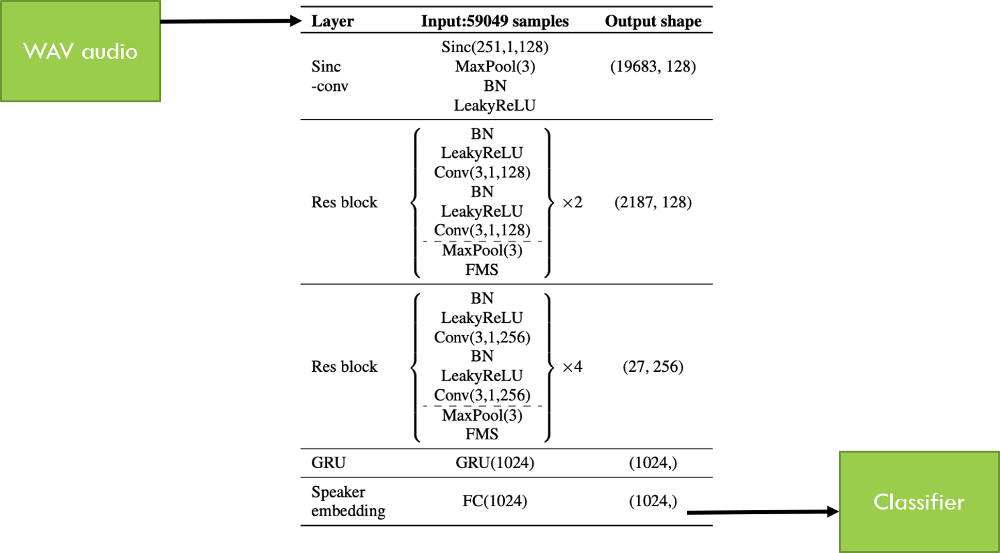

This project has adapted it for pathological voice classification by treating each demographic (e.g male, dysphonia, 41-65) as speakers. The rationale for this was because based on current research, the different demographics should have distinct characteristics from one another that would enable RawNet to distinguish between the different demographics. For example, male individuals would have a lower pitch than female individuals while individuals with a voice disorder would have a higher jitter and shimmer than healthy individuals.

### Verifying the performance of RawNet
Before adapting RawNet for classifying pathological voices, the original research was verified by replicating the research. This was done by training the RawNet model on voxCeleb, a dataset of speech recordings from celebrities. From the visualisation of the embeddings produced from the evaluation recordings (unseen by the model during training) by RawNet after training, it can be seen that all the speakers are in their own distinct clusters. Thus, it can be concluded that the original research was indeed successful in its purpose.

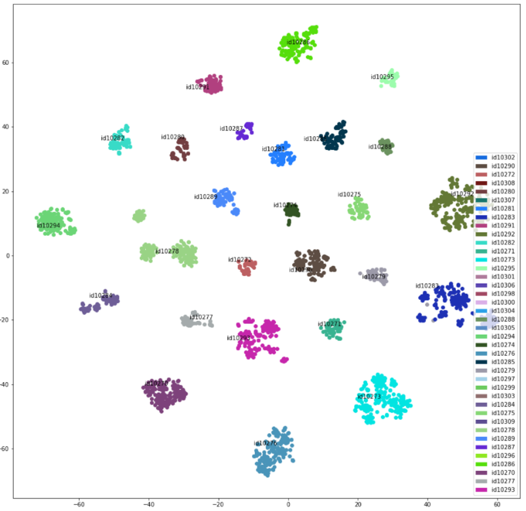

### Final Results
The classification with the RawNet model was conducted using the same scenarios as the baseline which utilised the SVD dataset mentioned under Datasets.

1. Multi-class classification (6 disorder classes): ~0.26 F1-score
2. Multi-class classification (5 high-data demographics): ~0.46 F1-score
3. 1 vs 1 classification of disorder classes: ~0.55 - 0.80 F1-score

The second multi-class situation indicates that although the model's performance is unsuitable for deployment at the moment, given enough data, the model could potentially discover good discriminators of the different disorders.

Additionally, within the 1 vs 1 classification scenario, there was a discrepancy between the F1-scores of healthy vs disorder and disorder vs disorder classifications. From this, it can be concluded that the characteristics of a healthy voice is likely to be more distinct from voices with a disorder. However, discriminating between the different disorders is likely to be more challenging since different disorders may affect an individual's voice in similar ways.

### Visualisation of Embeddings
To understand the final results in more detail, several visualisations of the embeddings obtained from the evaluation data have been created.

#### Disorder Visualisations
The two TSNE plots below show the female population (left) and male population (right), with the different colors of the dots indicating different disorders. Clearly, there are no distinct clusters formed in either population, indicating that there is no distinction between the embeddings from the disorders. This supports the earlier hypothesis that it is challenging to find a good discriminator between the different disorders. 

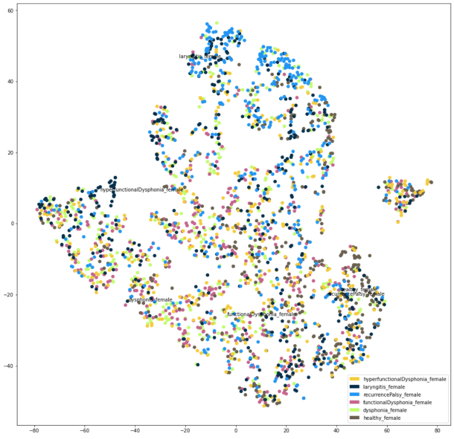
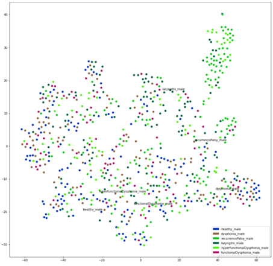

#### High-data Demographics Visualisations
Additionally, the TSNE plot below visualising the 5 high-data demographics show a small degree of clustering starting to occur, with a majority of the blue dots in the top left, majority of the red in the top right, and a number of light blue at the bottom. This also shows that with enough data, RawNet might be able to distinguish between the different demographics that it is trained on.

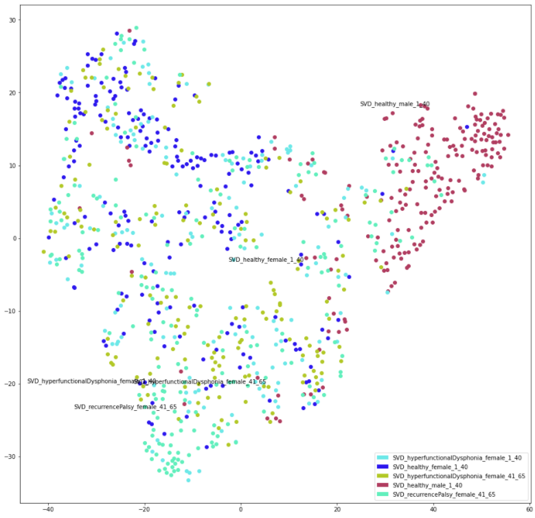

#### Gender Visualisations
Furthermore, the red dots representing the healthy male demographic are clearly separated from most of the other dots which are from female voice recordings, indicating that the model could perhaps distinguish gender. Further analysis with several visualisations of male vs female for each disorder confirmed this hypothesis. Examples of these visualisations are below where male vs female for healthy individuals is on the left and male vs female for individuals with recurrence palsy is on the right.

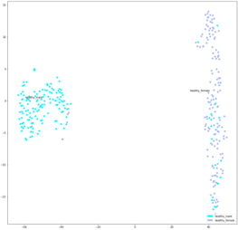
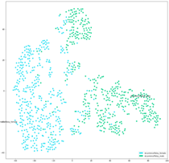

#### Healthy vs Disorder, Disorder vs Disorder Visualisations
Finally, the visualisations of embeddings for healthy vs disorder and disorder vs disorder scenarios also support the earlier hypotheses on the performance of the RawNet model. In the TSNE visualisations below, each figure shows the embeddings from a healthy vs disorder scenario, in particular, healthy vs recurrence palsy for males and healthy vs functional dysphonia for females. The different disorders are marked by different colors.

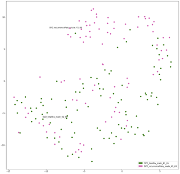
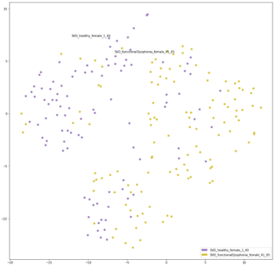

The TSNE embeddings below show the embeddings from disorder vs disorder scenarios, recurrence palsy vs laryngitis for males and functional dysphonia against hyperfunctional dysphonia for females.

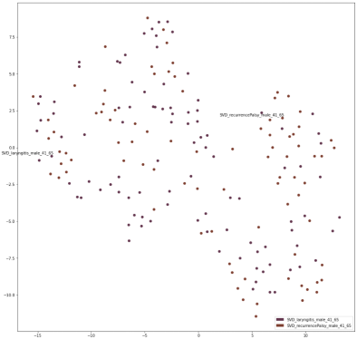
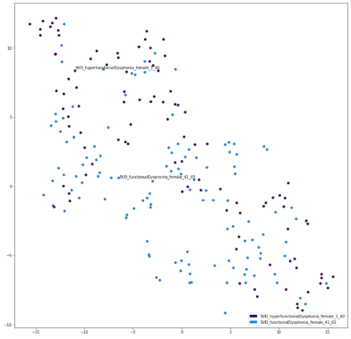

From these 4 visualisations, it can be seen that although there are no distinct clusters in the healthy vs disorder scenarios, the dots are still more separated than in the disorder vs disorder scenario. In the latter, the dots are evenly distributed, indicating that RawNet has found no effective discriminator to distinguish the disorders.

### Summary
In summary, although the SVD RawNet model in its current state is unable to discern between the multiple disorders, it is however, able to distinguish certain voice characteristics. For example, it can easily discern male voices from female voices and it also performs relatively well discerning healthy voices from unhealthy voices. To continue improving its performance in distinguishing disorders, more data is likely required.

The RawNet model also performed better than the baseline model, indicating the there is potential for deep-learned features to be more effective discriminators of what represents a particular voice disorder than handcrafted features. The table below indicates the difference in performance.

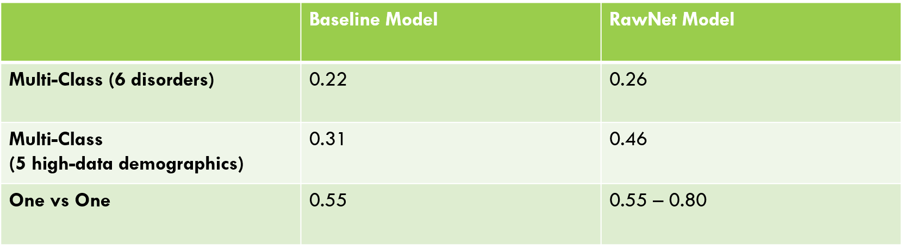

## Future Work
Much work remains even though this project has ended. Listed below are some of the additional steps that could be taken to take this project forward.

1. As mentioned earlier, the collection of additional pathological voice data to augment the current SVD dataset will likely boost the performance of RawNet significantly. 

2. Experimentation of other classifiers like Hidden Markov Models and Gaussian Mixture Models should also be carried out to continue improving the performance of pathological voice detection with handcrafted features.

3. RawNet should also be compared to other models that produce deep-learned audio features like X-vectors and PANNs.

## Appendix
### Links to research
1. Intra- and Inter-database study for Arabic, English and German databases: Do Conventional Speech Features Detect Voice Pathology?

https://www.sciencedirect.com/science/article/pii/S0892199716301837

2. Front-End Factor Analysis For Speaker Verification

https://ieeexplore.ieee.org/document/5545402

3. Identifying distinctive acoustic and spectral features in Parkinson's disease

https://www.researchgate.net/publication/335829678_Identifying_Distinctive_Acoustic_and_Spectral_Features_in_Parkinson's_Disease

4. Vocal Folds Disorder Detection using Pattern Recognition Methods

https://ieeexplore.ieee.org/document/4353023

5. Deep Neural Network Embeddings for Text-Independent Speaker Verification

https://danielpovey.com/files/2017_interspeech_embeddings.pdf

6. X-Vectors: Robust DNN Embeddings for Speaker Recognition

https://www.danielpovey.com/files/2018_icassp_xvectors.pdf

7. Pathological Speech Detection using X-Vector Embeddings

https://www.researchgate.net/publication/339641784_Pathological_speech_detection_using_x-vector_embeddings

8. RawNet: Advanced end-to-end deep neural network using raw waveforms for text-independent speaker verification

https://www.researchgate.net/publication/335829649_RawNet_Advanced_End-to-End_Deep_Neural_Network_Using_Raw_Waveforms_for_Text-Independent_Speaker_Verification

9. openSMILE -- The Munich Versatile and Fast Open-Source Audio Feature Extractor

https://www.researchgate.net/publication/224929655_openSMILE_--_The_Munich_Versatile_and_Fast_Open-Source_Audio_Feature_Extractor

### Links to Datasets
1. Saarbrucken Voice Database: http://stimmdb.coli.uni-saarland.de/index.php4#target

2. VOICED Database: https://physionet.org/content/voiced/1.0.0/

3. SLI-Database: https://lindat.mff.cuni.cz/repository/xmlui/handle/11372/LRT-1597
