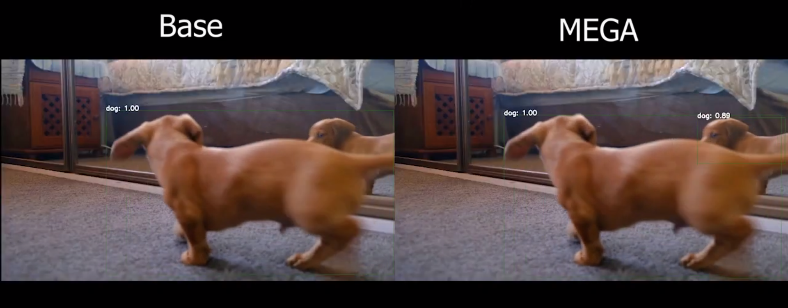
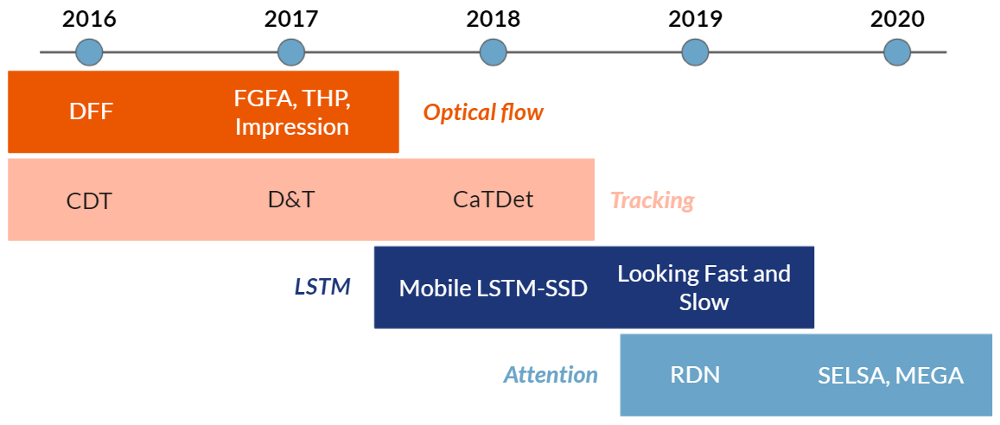
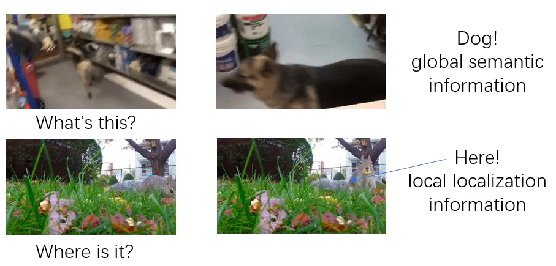
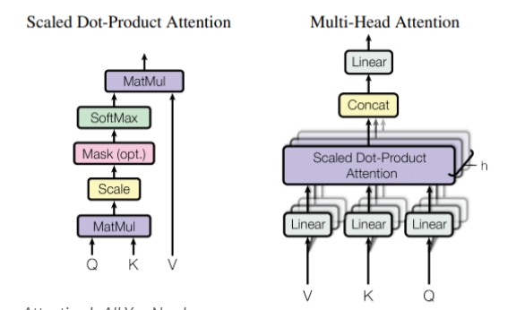
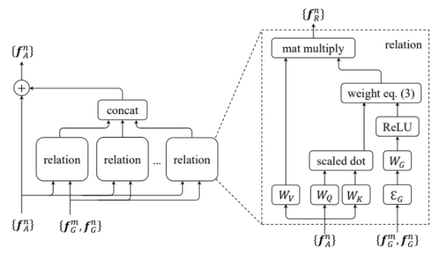
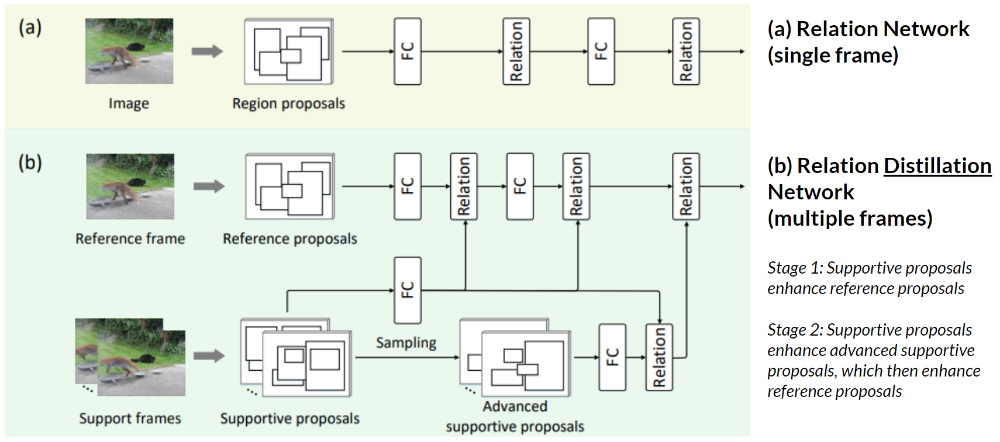
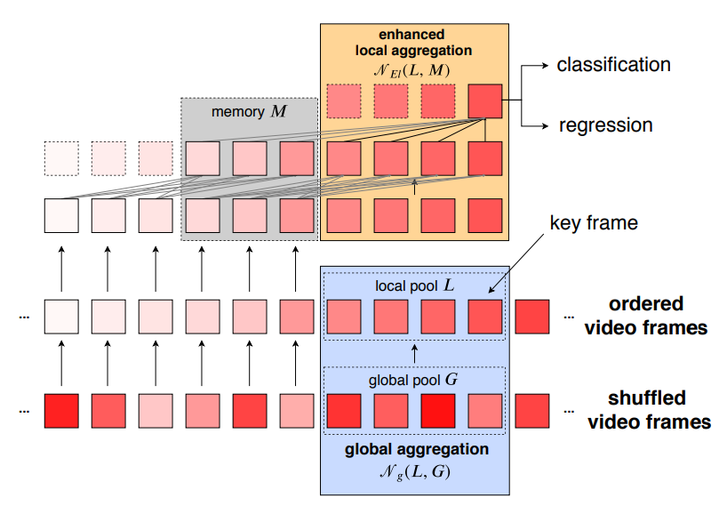

# Time to Detect Objects: Exploiting Temporal Information in Videos for Object Detection

## Background

Currently, when performing object detection on videos, we often just apply a regular image detector (e.g. R-FCN, SSD, [YOLO](https://pjreddie.com/darknet/yolo/)) on each frame of a video. This does work, but it does not exploit the temporal dimension of videos — videos are more than just a sequence of images, but also a sequence of related images. Furthermore, image recognition on videos may perform worse as they face unique challenges like motion blur and occlusion in certain frames, which are less frequent occurrences in images.

We can imagine that having access to other frames in the same video can help because (i) the same object likely appears in several frames in the same video, with perhaps better-quality image data (which can help with detection) and (ii) objects occupy similar regions in consecutive frames (which can help with localisation).

To show the difference in detection accuracy, we compare a single frame network with [MEGA](https://arxiv.org/abs/2003.12063) (one of the best VOD methods currently) in this video. Both use R-FCN with a ResNet101 backbone.

Click below for Demo Video!

## VOD Overview

We can thus look towards object detection methods built specifically for videos. There are a few main categories of networks we can look at:
    • Post-processing methods (methods that can be applied on top of regular image object detections to improve accuracy)
    • Optical flow
    • Tracking
    • Recurrent NNs / LSTM
    • Attention

This post will focus mostly on attention methods as they are the most recent and perform the best now. Additional details on each method can be found in the Annex.

Before the methods proper, note that when we use data from other frames to improve detection on a key frame, these other frames can be local (neighbouring frames) or global (from the entire video). Both of these have their advantages. Global frames help to identify objects by semantic similarities, and provide greater object variance (this reduces redundancy and possibly increases quality of frames, since any blur/occlusion might persist for several consecutive frames). Conversely, local frames help to locate and identify objects in similar contexts.

## Post-Processing Methods

While there are differences between these methods, they generally revolve around the idea of tracking objects throughout the video using semantic similarity and/or location in frame. By forming a “tube” of detections of the same object, weaker detections can be rescored to have higher confidence, duplicates can be removed, etc.  These tracking methods may be based off something like Deep SORT.

Some methods include [Sequence Non-Maximal Suppression](https://arxiv.org/abs/1602.08465), [Seq-Bbox Matching]((https://www.scitepress.org/Papers/2019/72600/72600.pdf)) and [Robust and Efficient Post-Processing](https://arxiv.org/abs/2009.11050).

## Optical Flow

Optical flow is the pattern of apparent motion of objects in a visual scene, by outputting pixel-level data on where each pixel can be found in the next frame (e.g. “this pixel moves 10 frames to the right”). One approach to perform optical flow estimation is using FlowNet, a CNN-based method.

[FlowNet Deep Feature Flow](https://arxiv.org/abs/1611.07715) uses this information to increase speed, propagating and warping features from a key frame to the subsequent frames with the optical flow data. [Flow-Guided Feature Aggregation](https://arxiv.org/abs/1703.10025) conversely increases accuracy by propagating features from nearby frames to the keyframe to enhance features. [Impression Network](https://arxiv.org/abs/1712.05896) and [Towards High Performance VOD](https://arxiv.org/abs/1711.11577) combines both of these ideas.

## Tracking

In some senses, these methods may be quite similar to the post-processing methods mentioned earlier as they try to track objects through various frames and form a “tube” of objects. The difference lies in that the networks have some sort of tracking built-in to them and are not just applied after detection occurs.

Some methods under this category include [Cooperative Detection and Tracking](https://link.springer.com/chapter/10.1007/978-3-319-46466-4_51), [Detect to Track and Track to Detect](https://arxiv.org/abs/1710.03958), and [Cascaded Tracked Detector](https://arxiv.org/abs/1810.00434). They all implement tracking quite differently, and can be interesting reads for interest.

## RNN / LSTM

A LSTM network is typically placed in between the feature extractor and the detection layers, so that the feature maps from the extractor can be fed into the LSTM network. The enhanced feature map from the LSTM module is then fed to the detection layers.

These methods have the ability to retain long-term temporal memory, at least more so than optical flow or tracking methods. The LSTM unit is quite standard, but some changes may be made to increase speed or to adapt it to image vectors (e.g. using convolutional operations).

Examples include [Mobile LSTM-SSD](https://arxiv.org/abs/1711.06368) and [Looking Fast and Slow](https://arxiv.org/abs/1903.10172).

## Attention

Before diving into the actual VOD methods, some background will need to be established first.
Attention mechanisms are built off an encoder-decoder structure and was [first presented for a machine translation context in 2014](https://arxiv.org/abs/1409.0473), with the main idea that only the most relevant input information is used at any one time when producing the output. The [transformer](https://arxiv.org/abs/1706.03762), a fully attention-based network, was introduced in 2017, again for an NLP context.

[Relation Networks](https://arxiv.org/abs/1711.11575) (RN) were introduced soon after the transformer as an image object detection method. It adapts the attention module of the Transformer to exploit relations between objects in the same frame. Note that RN is not a transformer (unlike [Vision Transformer](https://arxiv.org/abs/2010.11929)) — while it makes use of the transformer module, it is not fully attention-based.

RN requires a region-based object detector. Proposals for a single image are generated using an RPN, then each proposal box is enhanced by computing relation features as a weighted sum of semantic features from other boxes. The same key concepts of query, key and value in transformers, as well as how multiple attention modules are stacked and concatenated together, are maintained. However, changes are made to consider both appearance (convolutional features) and geometric (bounding box data) features.

Original transformer attention module             |  RN relation module
:-------------------------:|:-------------------------:
 | 

### VOD Methods

[Relation Distillation Networks](https://arxiv.org/abs/1908.09511) (RDN) [17] is quite similar to the original RN, but instead of just calculating relations between proposals of a single image, RDN calculates relations between proposals of the reference/key frame and the support (neighbouring) frames. The “distillation” part is due to the 2-stage network and the use of “advanced supportive proposals” as well. After proposals are enhanced, the features are fed to the detection layer to output the final classification and regression results.

While RDN makes use of neighbouring frames as support frames, [Sequence Level Semantic Aggregation](https://arxiv.org/abs/1907.06390) (SELSA) ignores the frame numbers entirely. Videos are just treated as an unordered “bag of frames”, and the support frames are randomly selected from throughout the entire video. It also uses cosine similarity instead of RN modules, but otherwise the concept is the same.

Note that RDN is a “local” method while SELSA is a “global” method. [Memory Enhanced Global-Local Aggregation](https://arxiv.org/abs/2003.12063) (MEGA) attempts to bridge both of these methods, and use both global and local frames when aggregating features. It also introduces a “memory” module that has the effect of increasing the number of frames used as support frames by caching intermediate features produced during the detection of the previous frames.

As an aside, [Hierarchical Video Relation Network](https://www.ecva.net/papers/eccv_2020/papers_ECCV/papers/123660426.pdf) (HVR-Net) currently performs even better than MEGA, but it relies on inter-video proposal relations (rather than just intra-video), i.e. detection requires several videos to be inputted.

## Conclusion

MEGA is definitely a promising VOD method. It can be easily converted to an online format to run in real-time.
Original code for MEGA has been published on [Scalsol's Github repository](https://github.com/Scalsol/mega.pytorch). During the course of the project, I have forked the repository to improve the original code by (i) building it into a Docker container (ii) implementing an online webcam demo and (iii) simplifying the use of custom datasets for training/testing. My repository can be found on my [Github Repository](https://github.com/amandakoh01/vod).

Credits to the paper [A Review of Video Object Detection: Datasets, Metrics and Methods](https://www.mdpi.com/2076-3417/10/21/7834) for introducing most of the papers and methods referenced in this post, as well as the blog post [The Ultimate Guide to Video Object Detection](https://blog.usejournal.com/the-ultimate-guide-to-video-object-detection-2ecf9459f180) for the summary of post-processing methods.

*Work done by [Amanda Koh](https://github.com/amandakoh01) as an intern at DH (supervisors: Ling Evan, Lee Ying Hui, Teo Jin Ming)

## Annex

Sharing slides: https://docs.google.com/presentation/d/1eC2Jv0QiWzoS5cq1WdvBMwcx8ARMyEQh1dnsL8hY-U0/edit?usp=sharing

